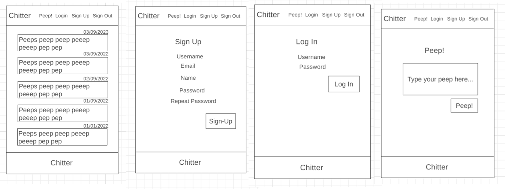

<!-- PROJECT SHIELDS -->
[![LinkedIn][linkedin-shield]](https://www.linkedin.com/in/sophie-beard-9a9842222/)


<!-- PROJECT LOGO -->
<br />
<div align="center">

<h3 align="center">Digital Future's Chitter Challenge</h3>

  <p align="center">
    This project is to write a full-stack small twitter clone that will allow users to post messages to a public wall.
    <br />
    <a href="link to repo"><strong>Explore the docs »</strong></a>
    <br />
    <br />
    <a href="link to repo">Report Bug</a>
  </p>
</div>


<!-- TABLE OF CONTENTS -->
<details>
  <summary>Table of Contents</summary>
  <ol>
    <li>
      <a href="#about-the-project">About The Project</a>
    </li>
    <li>
      <a href="#project-plan">Project Plan</a>
    </li>
    <li><a href="#project-review">Project Review</a></li>
    <li><a href="#contributing">Contributing</a></li>
    <li><a href="#contact">Contact</a></li>
    <li><a href="#acknowledgments">Acknowledgments</a></li>
  </ol>
</details>


<!-- ABOUT THE PROJECT -->
## About The Project

Challenge:
-------

You are going to write a small twitter clone that will allow users to post messages to a public wall.

Good luck and let the chitter begin!

Features:
-------

### Standard Acceptance Criteria
```
As a trainee software engineer
So that I can let people know what I am doing  
I want to post a message (peep) to chitter

As a trainee
So that I can see what others are saying  
I want to see all peeps in reverse chronological order

As a trainee
So that I can better appreciate the context of a peep
I want to see the time at which it was made

As a trainee
So that I can post messages on Chitter as me
I want to sign up for Chitter

As a trainee
So that only I can post messages on Chitter as me
I want to log in to Chitter

As a trainee
So that I can avoid others posting messages on Chitter as me
I want to log out of Chitter
```

Additional requirements:
------

* You don't have to be logged in to see the peeps.
* Trainee software engineers sign up to chitter with their email, password, name and a username (e.g. ewithers@digitalfutures.com, password123, Edward Withers, dearshrewdwit).
* The username and email are unique.
* Peeps (posts to chitter) have the name of the trainee and their user handle.
* Your README should indicate the technologies used, and give instructions on how to install and run the tests.

### Extended Acceptance Criteria

```
As a trainee
So that I can stay constantly tapped in to the shouty box of Chitter
I want to receive an email if I am tagged in a Peep

As a trainee
In order to start a conversation as a DFA trainee Software Engineer
I want to reply to a peep from another trainee.
```
<p align="right">(<a href="#readme-top">back to top</a>)</p>

# Project Plan

## Wireframes

The following wireframes were done for the project: 

They are in the order (from left to right): peep feed page, sign-up page, log-in page, make a peep!

## Front-End (ReactJS)

### Create a React App

The react app was created with: 
```
npx create-react-app frontend
```
Once installed, the application was run using:
```
npm start
```
It now shows the start up browser for a React application. The start up template was removed from the App.js file. 

The router was installed using:
```
npm install react-router-dom
```
This allows the pages that I am going to create - register, login, home, etc - to be moveable between each. 

### Application Set-Up

The Home page (which is going to show the peeps) was created as a component. The Login page (which is going to show a login form) and the Register page (which is going to show a register form) were created as components in an authorisation folder. If I have enough time, I would like to include authorisation for the login and register components.

The components were added into the App.js file and the routes added so that they can be navigated. 

Tests:

The testing framework that I am going to be using is Jest. 

App.js tests:
1. Test that the Chitter title is correctly rendered. 

Header tests:
1. Test that the header component is correctly rendered. 
Footer tests:
1. Test that the footer component is correctly rendered. 

### Style

I decided to use [MUI](https://mui.com/) and [Bootstrap](https://getbootstrap.com/) for the style components of my application. This was installed using:
```
npm install @mui/material @emotion/react @emotion/styled
```
and 
```
npm i bootstrap@5.2.3
```
I used the Roboto Font CDN and the Font Material Icons. I created a main component which allowed me to use a grid system. I imported the AppBar, Typography, Box and Toolbar features for the header component. Form components were styled using Bootstrap templates. 

### Register Page

For the register page, I used the MUI text field component. In order to cover the requirements:

"Trainee software engineers sign up to chitter with their email, password, name and a username (e.g. ewithers@digitalfutures.com, password123, Edward Withers, dearshrewdwit)."

I will include an email, password, name, and username field for sign-up. Also, I will need a submit button. I have also chosen to include a repeat password section for good UX. 

I used Ed's Register demo as a guide when building this component. 

To test the register page, 

Register.js Tests:
1. The form renders a submit button.
2. It should have the registration heading. 

### Peep Component

Peep.js Tests:
1. A peep should be rendered. 
2. A peep should render the user's details. 
3. The peep should have a correctly formatted time. 
4. The peep should have a correctly formatted date. 

### Post Peep
PostPeep.js Tests:
1. It should have a submit button. 
2. It should have a peep title. 

### Login 
1. The form renders a submit button.
2. It should have the login heading. 

### Logout
1. It should have a submit button. 
2. It should have the log out heading. 


### Backend (Express and NodeJS)

A backend folder was created in my project. The following commands were then run to set up the package.json file and install express:
```
npm init -y
npm install -g npm
npm i --save express
npm i --save-dev nodemon
npm i --save dotenv
npm i --save mongoose body-parser cors
```
An index.js file was created and the server setup. 

The testing framework that I am going to be using for the backend is Mocha and Chai. 

Tests:
1. The app should render when started. 

### MongoDB

MongoDB was connected to the database by typing 'mongosh {connection address}'. The server was then run and testing by sending 'Hello' to the /register browser. 

### Validation
```
npm i --save validator
```
was installed. 
The set-up for validator was followed from the [npm website](https://www.npmjs.com/package/validator). 

I also used [RegExr](https://regexr.com/) to ensure that the fields were input with valid properties. 

Tests: 
I used Postman to test the /register router. When the incorrect format was inputted, the correct error was returned. 

When all of the elements are returned with the correct format, we get an 'Ok!'

Now, instead of printing a message, we can check if the email address is already in the system. 

### Password Security

Unfortunately, I ran out of time before being able to fully implement bcrypt for my passwords. This is something that I would like to include in the future. However, passwords were initially encrypted as follows: 

[bcryptjs](https://www.npmjs.com/package/bcrypt) was added in order to protect the passwords and secure the user. 
```
npm i --save bcrypt
```
This was also tested with Postman. As you can see, the password has been returned encrypted.


If the same email is run again, the error that is returned is that of the repeat email: "Email is already linked to an account".

### Server 

Tested with Chai and Mocha

Tests:
1. The index route should return all the test peeps.
2. The index route should return the peeps in reverse chronological order 
3. The post route should have a 201 status when a peep is peeped. 
4. The post route should have a 422 status when a peep is invalid. 
5. The post route should have a 422 status when a peep included forbidden characters. 
6. The register route should have a 201 status when the user is successfully registered. 
7. The register route should give an alert message when the email already exists. 
8. The register route should not register an email if it already exists.
9. The register route should not register a username if it already exists. 
10. The register route should have a 422 status when an invalid password is used. 
11. The register route should have a 422 status when a name input is too short. 
12. The register route should have a 422 status if the name includes anything but letters. 
13. The register route should have a 422 status if the username contains anything other than letters and numbers. 
14. The login route should have a 200 status when a user logs in. 
15. The login route should send a message alert when the email is not registered. 
16. The login route should send a message alert when the password is incorrect. 
  
  


<p align="right">(<a href="#readme-top">back to top</a>)</p>


<!-- ROADMAP -->
## Project Review and Roadmap

This was my first full-stack application project. It was also my first time implementing some of the testing techniques that were used in this project. 

The application fully met the acceptance requirements for this challenge as the user can post a peep, peeps are in reverse chronological order, the time at which the peep was made is displayed, the user can sign up, log in, and log out of the application. The code is fully tested. This project achieved a 'Distinction'.

In the future I would like to:

1. Encrypt my passwords. I began doing this using salt and bcrypt, however, with more time I would like to implement it fully so that the encrypted passwords can be returned and decrypted for login functionalities. 
2. Tackle the extended criteria: I would like to try and implement a reply function for the peeps and also an email notification when a user's username is mentioned in a peep. 
3. I would like to have further test coverage. Testing is something that I am still trying to get to grips with, but I would like to add more tests so that the code is fully covered and tested. 

<p align="right">(<a href="#readme-top">back to top</a>)</p>


<!-- CONTRIBUTING -->
## Contributing

Contributions are encouraged and greatly appreciated! If you have a suggestion for what could make this better, please fork the repo and create a pull request. Thanks!

1. Fork the Project
2. Create your Feature Branch (`git checkout -b feature/AmazingFeature`)
3. Commit your Changes (`git commit -m 'Add some AmazingFeature'`)
4. Push to the Branch (`git push origin feature/AmazingFeature`)
5. Open a Pull Request

<p align="right">(<a href="#readme-top">back to top</a>)</p>


<!-- CONTACT -->
## Contact

Sophie Beard - beardsophie@outlook.com

Project Link: [https://github.com/your_username/repo_name](https://github.com/your_username/repo_name)

<p align="right">(<a href="#readme-top">back to top</a>)</p>


<!-- ACKNOWLEDGMENTS -->
## Acknowledgments

Use this space to list resources you find helpful and would like to give credit to. I've included a few of my favorites to kick things off!

* This README file was formatted from othneildrew's [template](https://github.com/sophiebeard/Best-README-Template).
* I found the tutorial by [Traversy Media](https://www.youtube.com/watch?v=vyJU9efvUtQ) very useful, with guidance on Material UI and how to use it. 
* I had difficulty connecting to the mongoDB database and was very grateful for the tutorial by [Adam Tech](https://www.youtube.com/watch?v=kYwt5srtDKw).

<p align="right">(<a href="#readme-top">back to top</a>)</p>


<!-- MARKDOWN LINKS & IMAGES -->
[linkedin-shield]: https://img.shields.io/badge/-LinkedIn-black.svg?style=for-the-badge&logo=linkedin&colorB=555
[linkedin-url]: https://linkedin.com/in/othneildrew
